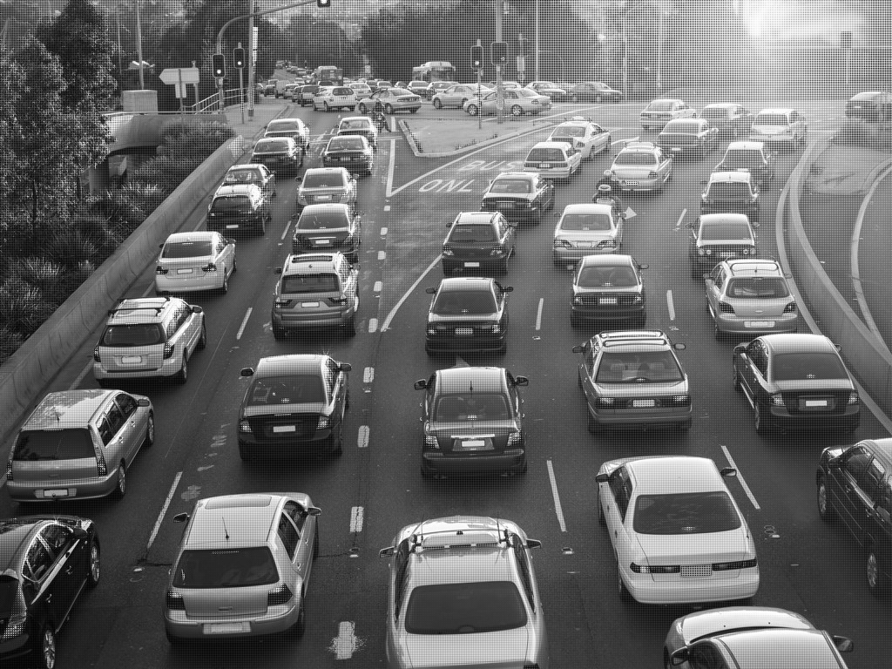
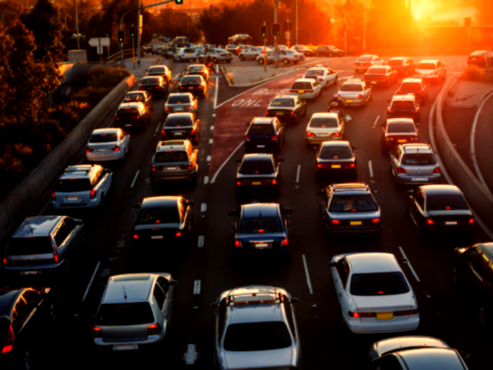
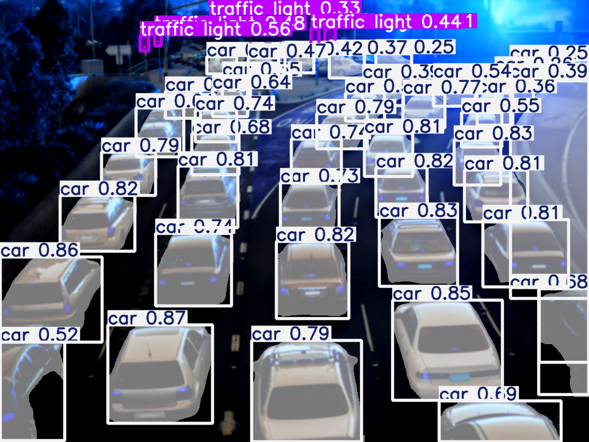

# A differentiable end-to-end ISP for Advanced Driver Assistance Systems (ADAS)

This is an end-to-end differentiable ISP implemented by pytorch. 

You can generate the RGB image from RAW data, then apply the high-level computer-vision methods in an end-to-end fashion (like detection, segmentation, etc.)

## NOTICE: No Commercial Use

## Example
### Demo
```
python main.py
```
### Raw input:

### ISP output:

### YOLO 11 detection/segmentation result



## Contact

best.novel.experience@gmail.com

by Youshua@BNE Group
